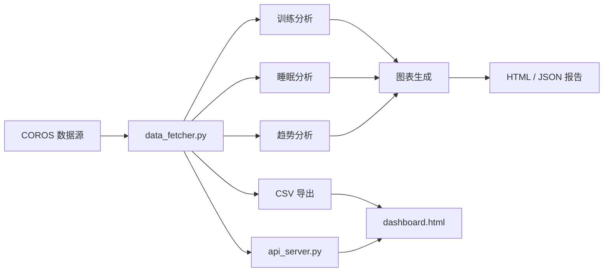
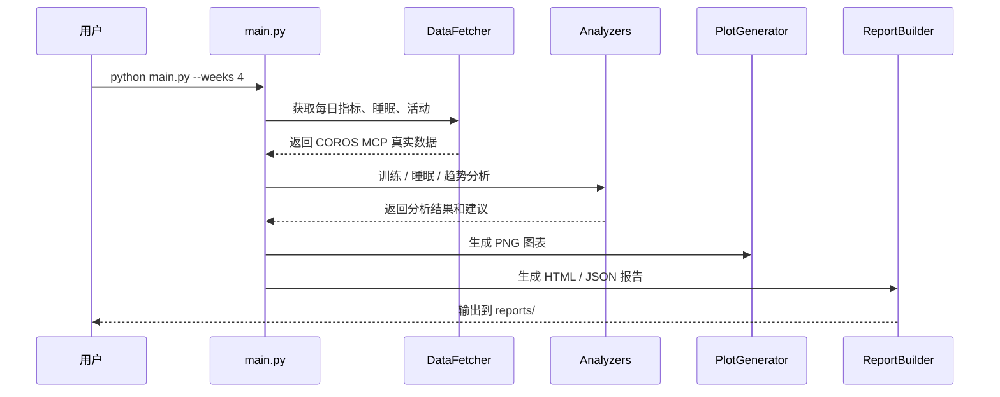
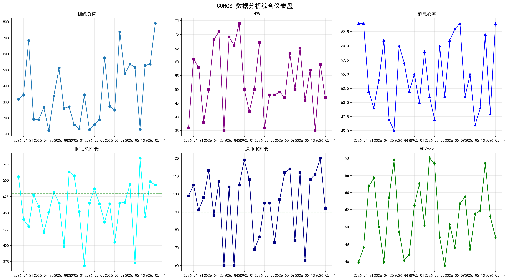
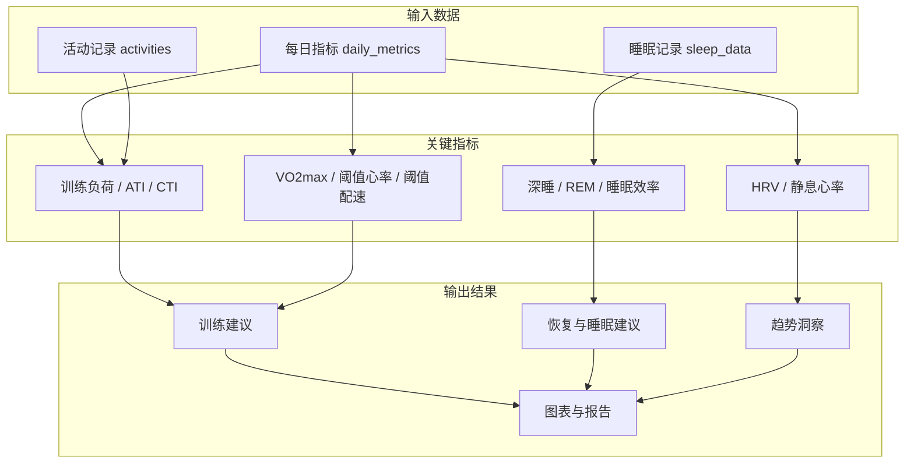

# COROS 运动数据分析系统

一个面向 COROS 运动与健康数据的本地分析系统，支持数据获取、训练负荷分析、睡眠质量分析、长期趋势洞察、HTML/JSON 报告生成、CSV 导出，以及可交互的网页 Dashboard。

> Dashboard 只展示通过 COROS MCP 读取到的真实数据；未接入 `coros-mcp` 时不会展示模拟数据。

## 项目一览



## 核心能力

| 模块 | 文件 | 作用 |
| --- | --- | --- |
| 数据获取 | `api_server.py` | 通过 `coros-mcp` 获取每日指标、睡眠记录、运动活动 |
| 训练分析 | `analyzers/training_analyzer.py` | 分析训练负荷、ATI/CTI、VO2max、静息心率、过度训练风险 |
| 睡眠分析 | `analyzers/sleep_analyzer.py` | 分析总睡眠、深睡、REM、清醒时长、睡眠效率与质量评分 |
| 趋势分析 | `analyzers/trend_analyzer.py` | 识别 HRV、RHR、VO2max、训练负荷等长期变化 |
| 图表生成 | `visualizers/plot_generator.py` | 生成训练、睡眠、趋势和综合仪表盘图片 |
| 报告生成 | `visualizers/report_builder.py` | 输出 HTML 分析报告和 JSON 结构化报告 |
| 数据导出 | `export_data.py` | 导出 `daily_metrics`、`sleep_data`、`activities` 三类 CSV |
| Web API | `api_server.py` | 为 Dashboard 提供本地 REST API，支持 Flask 或基础 HTTP Server |
| Dashboard | `dashboard.html` | 浏览器端可视化看板，可读取 API 或导入 CSV |

## 目录结构

```text
coros_analysis_system/
├── analyzers/
│   ├── sleep_analyzer.py       # 睡眠分析
│   ├── training_analyzer.py    # 训练分析
│   └── trend_analyzer.py       # 趋势分析
├── visualizers/
│   ├── plot_generator.py       # 图表生成
│   └── report_builder.py       # 报告生成
├── exports/                    # CSV 导出目录
├── reports/                    # 图表、HTML、JSON 报告目录
├── api_server.py               # 本地 API 服务
├── config.py                   # 项目配置
├── dashboard.html              # 网页 Dashboard
├── data_fetcher.py             # 数据获取层
├── export_data.py              # CSV 导出工具
├── main.py                     # 命令行分析入口
├── requirements.txt            # Python 依赖
└── README.md
```

## 快速开始

### 1. 安装依赖

建议使用 Python 3.11 或更高版本。

```bash
pip install -r requirements.txt
```

### 2. 配置 COROS 账号

复制示例配置为本地私有配置，再填写自己的 COROS 信息：

```bash
cp config.example.py config.py
```

`config.py` 已加入 `.gitignore`，不会再同步到 GitHub。

```python
COROS_CONFIG = {
    "email": "your_email@example.com",
    "password": "your_password",
    "region": "asia",  # 可选: eu, us, asia
}
```

也可以不在文件中写明文密码，改用环境变量 `COROS_EMAIL`、`COROS_PASSWORD`、`COROS_REGION`。

### 3. 运行完整分析

```bash
python main.py
```

常用参数：

```bash
# 分析最近 8 周
python main.py --weeks 8

# 只分析睡眠
python main.py --mode sleep

# 只分析训练
python main.py --mode training

# 只分析趋势
python main.py --mode trend

# 完整分析但不拉取活动记录
python main.py --no-activities
```

## 运行流程



## 输出结果

运行完整分析后，`reports/` 目录会生成以下文件：

| 文件 | 说明 |
| --- | --- |
| `training_load_trend.png` | 训练负荷趋势图 |
| `hrv_trend.png` | HRV 趋势图 |
| `rhr_trend.png` | 静息心率趋势图 |
| `vo2max_trend.png` | VO2max 趋势图 |
| `sleep_stages.png` | 睡眠阶段分布图 |
| `sleep_quality.png` | 睡眠质量评分图 |
| `comprehensive_dashboard.png` | 综合仪表盘图片 |
| `coros_analysis_report_*.html` | 可阅读的 HTML 分析报告 |
| `coros_analysis_report_*.json` | 结构化 JSON 分析结果 |

如果已有图表，可在 Markdown 中直接预览：



## Web Dashboard

项目包含一个独立的 `dashboard.html`，可通过两种方式使用。

### 方式一：通过本地 API 服务

```bash
python api_server.py --port 5000
```

然后在浏览器打开：

```text
http://127.0.0.1:5000/dashboard.html
```

API 服务提供的主要接口：

| 接口 | 说明 |
| --- | --- |
| `/api/status` | 服务状态 |
| `/api/daily_metrics?weeks=52` | 每日指标 |
| `/api/sleep_data?weeks=52` | 睡眠数据 |
| `/api/activities?weeks=52` | 活动记录 |
| `/api/activity/<activity_id>` | 单次活动详情 |
| `/api/all?weeks=52` | 一次性获取 Dashboard 所需数据 |

如果未安装或无法调用 `coros-mcp`，API 会返回错误，Dashboard 不会展示模拟数据。

### 方式二：导出 CSV 后手动导入

```bash
python export_data.py --weeks 52
```

导出文件位于 `exports/`：

| 文件 | 内容 |
| --- | --- |
| `daily_metrics_52w.csv` | 每日 HRV、RHR、训练负荷、VO2max 等 |
| `sleep_data_52w.csv` | 睡眠总时长、深睡、REM、质量评分等 |
| `activities_52w.csv` | 运动记录、时长、距离、心率、训练负荷等 |

随后打开 `dashboard.html`，在页面中选择这些 CSV 文件导入。

## 数据与分析关系



## 指标说明

### 训练指标

| 指标 | 含义 | 阅读方式 |
| --- | --- | --- |
| Training Load | 单日训练负荷 | 反映训练刺激大小 |
| ATI | 急性训练负荷 | 代表近期训练压力 |
| CTI | 慢性训练负荷 | 代表长期体能基础 |
| ATI/CTI | 训练负荷比 | 常用健康区间约为 `0.8 - 1.3` |
| VO2max | 最大摄氧量 | 越高通常代表有氧能力越强 |
| RHR | 静息心率 | 突然升高可能提示恢复不足 |
| HRV | 心率变异性 | 长期下降可能提示压力或疲劳累积 |

### 睡眠指标

| 指标 | 含义 | 参考标准 |
| --- | --- | --- |
| 总睡眠时长 | 夜间总睡眠分钟数 | 建议结合个人基线判断 |
| 深睡时长 | 恢复性睡眠阶段 | `> 90` 分钟通常较好 |
| REM 时长 | 快速眼动睡眠 | `> 90` 分钟通常较好 |
| 清醒时长 | 夜间醒来时间 | 越低通常越连续 |
| 睡眠效率 | 实际睡眠 / 总卧床时间 | `> 85%` 通常较好 |
| 睡眠质量评分 | 综合质量分 | `> 85` 通常较好 |

## COROS MCP 集成说明

系统设计上可与 [COROS MCP Server](https://github.com/cygnusb/coros-mcp) 配合使用。`api_server.py` 会尝试通过命令行调用：

```bash
coros-mcp call <tool_name> <params_json>
```

预期工具包括：

| 工具 | 作用 |
| --- | --- |
| `get_daily_metrics` | 获取每日健康与训练指标 |
| `get_sleep_data` | 获取睡眠记录 |
| `list_activities` | 获取活动列表 |
| `get_activity_detail` | 获取单次活动详情 |

如果 MCP 未安装、超时或返回错误，系统会返回错误并在页面上提示 MCP 数据未加载。

## 技术栈

| 类型 | 依赖 |
| --- | --- |
| 语言 | Python 3.11+ |
| 数据处理 | pandas, numpy |
| 图表 | matplotlib, seaborn |
| HTTP/API | requests, Flask 可选 |
| 日期处理 | python-dateutil |
| JSON | simplejson |
| 前端 | 原生 HTML / CSS / JavaScript |

## 常见任务

```bash
# 生成 4 周完整报告
python main.py --weeks 4

# 生成 52 周数据导出
python export_data.py --weeks 52

# 启动本地 Dashboard API
python api_server.py --port 5000

```

## 注意事项

- 当前仓库中的部分源码注释和字符串存在编码损坏现象，但主要业务结构仍可从代码中识别。
- Dashboard 不再展示模拟数据；请先确认 MCP 服务和账号配置可用。
- `reports/` 与 `exports/` 中的文件属于运行产物，可按需要保留、清理或加入版本控制忽略规则。
- 本系统不提供医学诊断。训练、恢复和睡眠建议仅供个人复盘参考。

## 参考链接

- [COROS 官网](https://www.coros.com/)
- [COROS MCP Server](https://github.com/cygnusb/coros-mcp)
- [Model Context Protocol](https://modelcontextprotocol.io/)

---

本项目用于个人运动数据分析、训练复盘和可视化探索。
